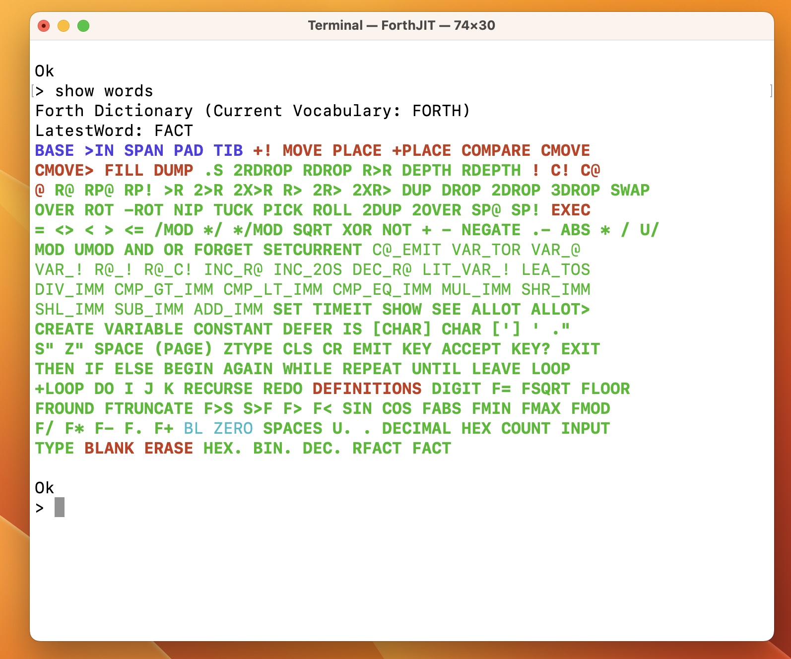

# MacForthIntel
MacForthIntel

This is the intel X86_64 version of my MacForth, under development.

This FORTH is a non-standard compiler using ASMJIT.

The native core Forth words, have a generator function, that jits their code, and also creates the words
use by the interpreter.

Forth words are tokenized, the tokens are then optimized, allowing common FORTH word patterns to be replaced with more
efficient MACRO Words that the compiler then uses. This is limited but extensible.

This is a CMAKE project 
I use CLion IDE, with the JetBrains AI, but the original ideas have a fully human origin.

This is an exercise in LLM coding with the JetBrains AI, and cognitive therapy for me, as the human collaborator.

##### Goals

Reasonably fast, reasonably friendly, slightly safer FORTH for Intel Mac computers.

**Features**

* Simplicity.
* Interactive.
* Helpful utilities (show and set)
* Directly compiled code, simple extensible optimizing compiler.
* Dynamic memory allocation for allot.
* Minimal set of core FORTH words implemented.
* LET infix expression for numeric functions.
* Commented assembly code for human and AI review.
* Assembled with AMSJIT.
* Separate code, headers and data.

Still in progress.

This should run on a wide variety of intel Macs (see ebay)
This will also run a little more slowly under Rosetta 2 on Apple Silicon if you disable AVX512.

